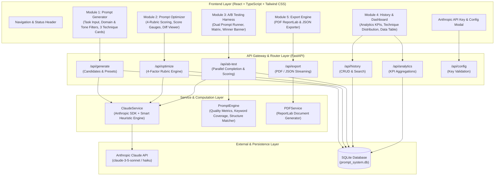
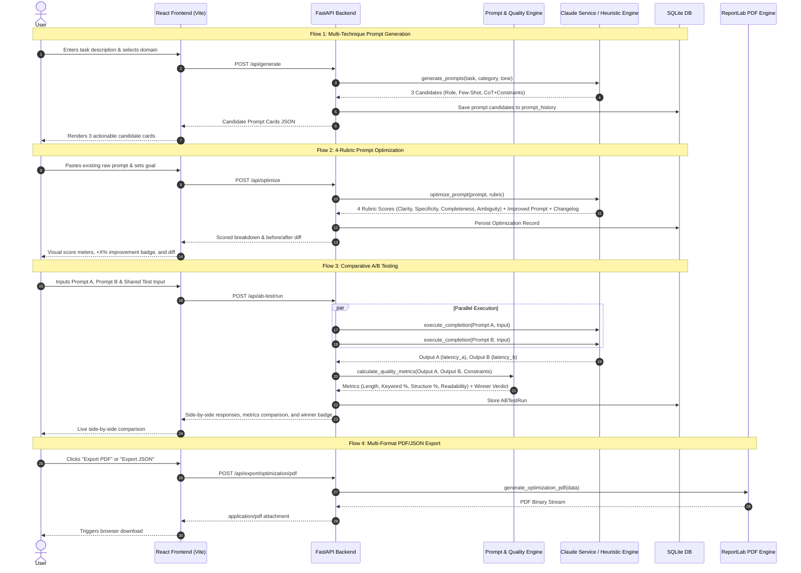

# System Architecture: AI-Powered Prompt Generation and Optimization System

## 1. High-Level Component Diagram

```mermaid
graph TB
    subgraph "Frontend Layer (React + TypeScript + Tailwind CSS)"
        UI_NAV["Navigation & Status Header"]
        M1["Module 1: Prompt Generator<br/>(Task Input, Domain & Tone Filters, 3 Technique Cards)"]
        M2["Module 2: Prompt Optimizer<br/>(4-Rubric Scoring, Score Gauges, Diff Viewer)"]
        M3["Module 3: A/B Testing Harness<br/>(Dual Prompt Runner, Matrix, Winner Banner)"]
        M4["Module 4: History & Dashboard<br/>(Analytics KPIs, Technique Distribution, Data Table)"]
        M5["Module 5: Export Engine<br/>(PDF ReportLab & JSON Exporter)"]
        KEY_MODAL["Anthropic API Key & Config Modal"]
    end

    subgraph "API Gateway & Router Layer (FastAPI)"
        R_GEN["/api/generate<br/>(Candidates & Presets)"]
        R_OPT["/api/optimize<br/>(4-Factor Rubric Engine)"]
        R_AB["/api/ab-test<br/>(Parallel Completion & Scoring)"]
        R_HIST["/api/history<br/>(CRUD & Search)"]
        R_ANALYTICS["/api/analytics<br/>(KPI Aggregations)"]
        R_EXP["/api/export<br/>(PDF / JSON Streaming)"]
        R_CONF["/api/config<br/>(Key Validation)"]
    end

    subgraph "Service & Computation Layer"
        CLAUDE_SVC["ClaudeService<br/>(Anthropic SDK + Smart Heuristic Engine)"]
        PROMPT_ENG["PromptEngine<br/>(Quality Metrics, Keyword Coverage, Structure Matcher)"]
        PDF_SVC["PDFService<br/>(ReportLab Document Generator)"]
    end

    subgraph "External & Persistence Layer"
        ANTHROPIC_API["Anthropic Claude API<br/>(claude-3-5-sonnet / haiku)"]
        SQLITE_DB[("SQLite Database<br/>(prompt_system.db)")]
    end

    %% Connections
    M1 --> R_GEN
    M2 --> R_OPT
    M3 --> R_AB
    M4 --> R_HIST
    M4 --> R_ANALYTICS
    M5 --> R_EXP
    KEY_MODAL --> R_CONF

    R_GEN --> CLAUDE_SVC
    R_OPT --> CLAUDE_SVC
    R_AB --> CLAUDE_SVC
    R_AB --> PROMPT_ENG
    R_EXP --> PDF_SVC

    R_GEN --> SQLITE_DB
    R_OPT --> SQLITE_DB
    R_AB --> SQLITE_DB
    R_HIST --> SQLITE_DB
    R_ANALYTICS --> SQLITE_DB

    CLAUDE_SVC --> ANTHROPIC_API
```

## 2. End-to-End Data Flow Diagram

```mermaid
sequenceDiagram
    autonumber
    actor User
    participant React as React Frontend (Vite)
    participant FastAPI as FastAPI Backend
    participant PromptEng as Prompt & Quality Engine
    participant Claude as Claude Service / Heuristic Engine
    participant DB as SQLite DB
    participant PDF as ReportLab PDF Engine

    %% Flow 1: Generation
    Note over User, DB: Flow 1: Multi-Technique Prompt Generation
    User->>React: Enters task description & selects domain
    React->>FastAPI: POST /api/generate
    FastAPI->>Claude: generate_prompts(task, category, tone)
    Claude-->>FastAPI: 3 Candidates (Role, Few-Shot, CoT+Constraints)
    FastAPI->>DB: Save prompt candidates to prompt_history
    FastAPI-->>React: Candidate Prompt Cards JSON
    React-->>User: Renders 3 actionable candidate cards

    %% Flow 2: Optimization
    Note over User, DB: Flow 2: 4-Rubric Prompt Optimization
    User->>React: Pastes existing raw prompt & sets goal
    React->>FastAPI: POST /api/optimize
    FastAPI->>Claude: optimize_prompt(prompt, rubric)
    Claude-->>FastAPI: 4 Rubric Scores (Clarity, Specificity, Completeness, Ambiguity) + Improved Prompt + Changelog
    FastAPI->>DB: Persist Optimization Record
    FastAPI-->>React: Scored breakdown & before/after diff
    React-->>User: Visual score meters, +X% improvement badge, and diff

    %% Flow 3: A/B Testing
    Note over User, DB: Flow 3: Comparative A/B Testing
    User->>React: Inputs Prompt A, Prompt B & Shared Test Input
    React->>FastAPI: POST /api/ab-test/run
    par Parallel Execution
        FastAPI->>Claude: execute_completion(Prompt A, Input)
        FastAPI->>Claude: execute_completion(Prompt B, Input)
    end
    Claude-->>FastAPI: Output A (latency_a), Output B (latency_b)
    FastAPI->>PromptEng: calculate_quality_metrics(Output A, Output B, Constraints)
    PromptEng-->>FastAPI: Metrics (Length, Keyword %, Structure %, Readability) + Winner Verdict
    FastAPI->>DB: Store ABTestRun
    FastAPI-->>React: Side-by-side responses, metrics comparison, and winner badge
    React-->>User: Live side-by-side comparison

    %% Flow 4: Export
    Note over User, PDF: Flow 4: Multi-Format PDF/JSON Export
    User->>React: Clicks "Export PDF" or "Export JSON"
    React->>FastAPI: POST /api/export/optimization/pdf
    FastAPI->>PDF: generate_optimization_pdf(data)
    PDF-->>FastAPI: PDF Binary Stream
    FastAPI-->>React: application/pdf attachment
    React-->>User: Triggers browser download
```
